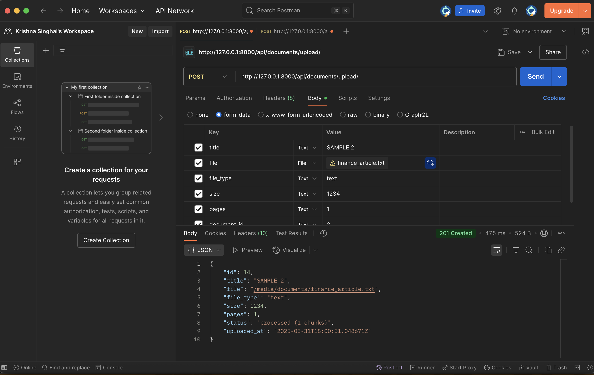
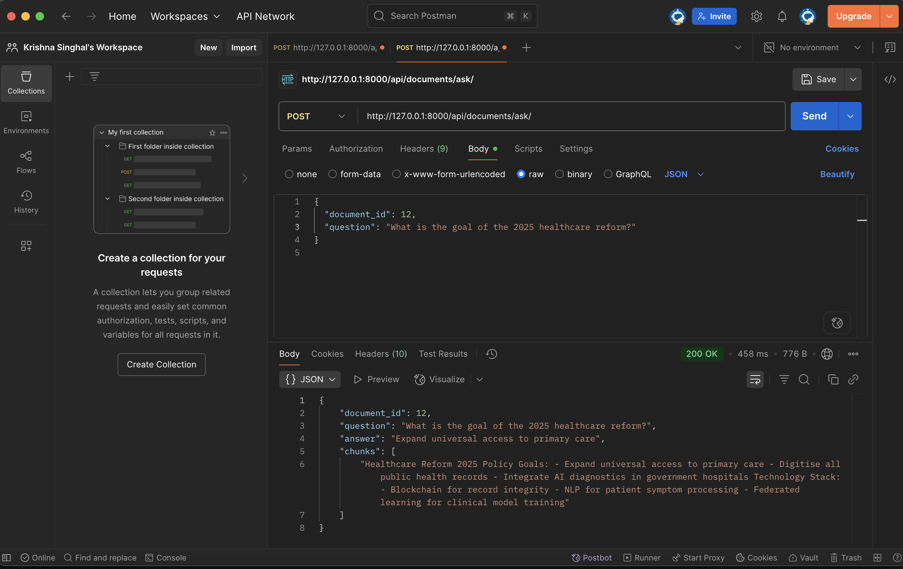
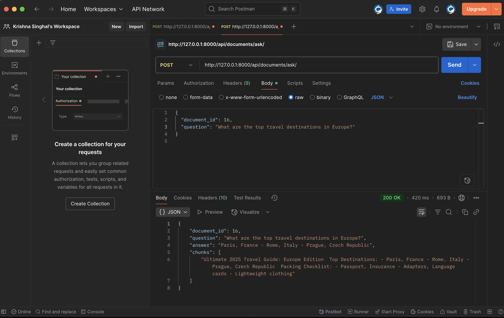
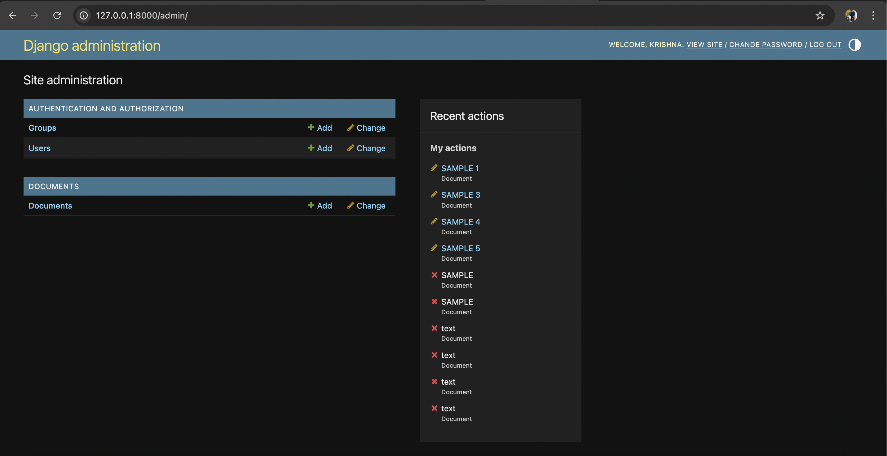

# 🧠 Document Intelligence Platform (Backend-Only)

A backend-powered Retrieval-Augmented Generation (RAG) system that allows users to upload documents (PDF, DOCX, TXT) and ask contextual questions. It retrieves relevant document chunks and generates intelligent answers using transformer-based models.

---

## 📌 Features

- Upload PDF/DOCX/TXT documents via API
- Automatic text extraction and chunking
- Embedding via SentenceTransformer
- Similarity search using ChromaDB
- Contextual answers via HuggingFace QA pipeline
- Document filtering for accurate responses
- Admin interface for document management

---

## 🖼️ Screenshots

> Add your images in the `screenshots/` folder, e.g.:

- 
- 
- 
- 
- 
- 
- 

---

## ⚙️ Setup Instructions

# Clone the repository
git clone https://github.com/Sortedsinghal/Document-Intelligence-Platform.git
cd Document-Intelligence-Platform

# Create virtual environment
python3 -m venv venv
source venv/bin/activate

# Install dependencies
pip install -r requirements.txt

# Run database migrations
python manage.py migrate

# Start the Django server
python manage.py runserver

# 📘 Document Intelligence Platform

A backend-powered intelligent document question-answering system using Django, ChromaDB, and transformer-based embeddings. Upload documents and query their contents using natural language.

## 📂 API Documentation

### ➕ POST `/api/documents/upload/`
**Upload a document for processing.**

**Form-Data Fields:**
- `title`: *(text)* — Title of the document
- `file`: *(file)* — The document file to be uploaded (`.pdf`, `.txt`, `.docx`)

---

### ❓ POST `/api/documents/ask/`
**Ask a question about a specific uploaded document.**

**JSON Body:**

{
  "document_id": 14,
  "question": "What is the goal of the 2025 healthcare reform?"
}

{
  "document_id": 12,
"question": "What is the goal of the 2025 healthcare reform?",
"answer": "Expand universal access to primary care",
"chunks": [
"Healthcare Reform 2025 Policy Goals: - Expand universal access to primary care - Digitise all public health records - Integrate AI diagnostics in government hospitals Technology Stack:
Blockchain for record integrity - NLP for patient symptom processing - Federated learning for clinical model training" ]
}

## 📄 Sample Questions & Answers

| Document Title               | Sample Question                                 | Answer                                  |
| ---------------------------- | ----------------------------------------------- | --------------------------------------- |
| "healthcare_policy.pdf"      | What is the goal of the 2025 healthcare reform? | Expand universal access to primary care |
| "finance_article.txt"        | What technologies are used in modern fintech?   | AI-driven underwriting, KYC automation  |
| "travel_guide.docx"          | What are the top travel destinations in Europe? | Paris, Rome, Prague                     |
| "ai_research_summary.docx"   | What are the top AI trends in 2024?             | Google Gemini, Meta LLaMA               |
| "legal_contract_excerpt.txt" | How can this agreement be terminated?           | With a 30-day notice in writing         |

## 📦 Requirements
All dependencies are listed in the requirements.txt file.

Key Libraries Used:
- Django
- transformers
- sentence-transformers
- chromadb
- python-docx
- PyMuPDF (imported as fitz)

🗂️ Sample Documents

Sample files uploaded or used for testing include:
- healthcare_policy.pdf
- finance_article.txt
- ai_research_summary.docx
- travel_guide.docx
- legal_contract_excerpt.txt

These documents are typically stored in the /media/documents/ directory after uploading through the API.
